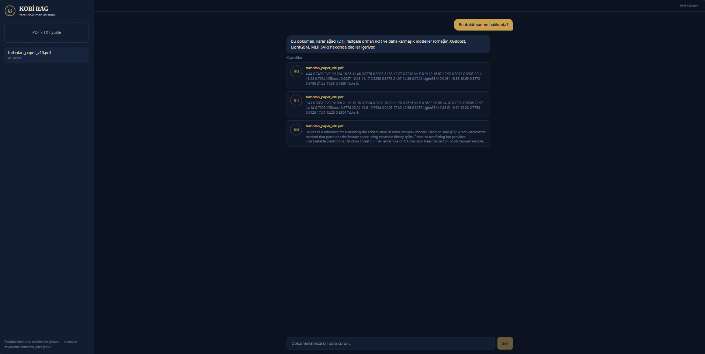
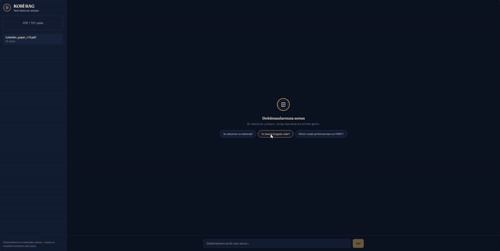

# KOBİ RAG — Fully Local Document Q&A Assistant


Upload your documents and ask questions — everything runs **100% locally**.
PDF/TXT files are chunked and embedded, questions are matched via semantic
search, and answers are generated by a local LLM grounded strictly in your
document content. No data ever leaves your machine.

Built for Turkish SMEs (KOBİ), works in any language your documents are in.



**Live streaming demo** — asking a Turkish question about an English research
paper and getting a grounded Turkish answer:



## Features

- **100% local & private** — the LLM (Qwen3-4B on GPU via Foundry Local), the
  embedding model and the vector database all run on your own machine; no
  internet connection or API keys required
- **Streaming answers** — responses arrive word by word over SSE
  (Server-Sent Events)
- **Source attribution** — every answer lists which chunks of which documents
  it was grounded in, together with their relevance scores
- **Hallucination guard** — if the answer is not in your documents, the model
  says so explicitly instead of making things up
- **Smart chunking** — sentence-boundary-aware splitting plus automatic
  references-section filtering for academic PDFs
- **Hybrid retrieval with reranking** — embedding search and BM25 keyword
  search are fused, then a cross-encoder re-scores the shortlist; measured on
  a 59-question golden set this took Hit@1 from 0.475 to 0.729 and MRR@10 from
  0.628 to 0.816 (see [backend/eval](backend/eval/README.md))
- **Cross-lingual** — thanks to a multilingual embedding model, you can ask in
  Turkish about English documents (and vice versa) and get answers in the
  language of your question

## Architecture

```
Question ─┬→ embedding search (sqlite-vec)  ─┐
          └→ BM25 keyword search (FTS5)     ─┴→ weighted RRF → top 10
         → cross-encoder reranking → top-k chunks
         → chunks + question to the local LLM (Foundry Local, Qwen3-4B)
         → answer streamed to the browser over SSE, sources shown with scores
```

Retrieval runs both searches for every question and merges them by Reciprocal
Rank Fusion, which combines rankings by position and so avoids comparing a
cosine similarity against a BM25 score. Keyword results carry slightly less
weight (0.95) than embedding results, so they add to the ranking rather than
overrule it. A multilingual cross-encoder then re-scores the shortlist, which
is where most of the accuracy comes from: it reads the question and the chunk
together instead of comparing two independently built vectors.

Every part of this was chosen by measurement against a golden set rather than
by feel, and each step is reproducible — see
[backend/eval/README.md](backend/eval/README.md) for the numbers, the
alternatives that were rejected, and the trade-offs that were accepted.

| Layer | Technology |
|---|---|
| Frontend | React 19, Vite, Tailwind CSS v4 |
| API | FastAPI, SSE streaming |
| Text extraction | PyMuPDF |
| Embeddings | sentence-transformers (paraphrase-multilingual-MiniLM-L12-v2) |
| Vector search | SQLite + sqlite-vec |
| Keyword search | SQLite FTS5 (BM25, Turkish stopword filtering) |
| Reranking | sentence-transformers CrossEncoder (mmarco-mMiniLMv2-L12-H384-v1) |
| LLM | Qwen3-4B — Foundry Local (OpenAI-compatible API) |
| Testing / Linting | pytest, ruff |

Repository layout:

```
kobi-rag/
├── backend/
│   ├── app/      # FastAPI: endpoints, CORS, dependencies
│   ├── rag/      # extraction, chunking, embedding, store, retrieval, llm
│   └── tests/
├── frontend/     # React + Vite + Tailwind UI
└── docs/
```

## Getting started

Requirements: Python 3.12+, Node 20+,
[Foundry Local](https://learn.microsoft.com/en-us/azure/ai-foundry/foundry-local/)

**Backend:**

```bash
cd backend
python -m venv .venv
.venv\Scripts\activate        # Windows (Linux/macOS: source .venv/bin/activate)
pip install -e . --group dev
uvicorn app.main:app --reload
```

On first run the embedding model and the LLM are downloaded automatically;
the first question takes a little longer while the model loads into memory.

**Frontend:**

```bash
cd frontend
npm install
npm run dev
```

Open `http://localhost:5173`, upload a PDF and start asking.

## Tests

```bash
cd backend
pytest          # 22 tests
ruff check .
```

## API

| Endpoint | Description |
|---|---|
| `POST /documents` | Upload a PDF/TXT (chunk + embed) |
| `GET /documents` | List uploaded documents |
| `DELETE /documents/{source}` | Delete a document and its chunks |
| `POST /search` | Hybrid search + reranking (no LLM) |
| `POST /ask` | Ask a question — full answer at once |
| `POST /ask/stream` | Ask a question — answer streamed over SSE |

## License

MIT